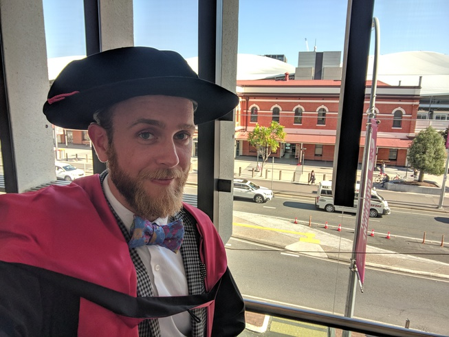
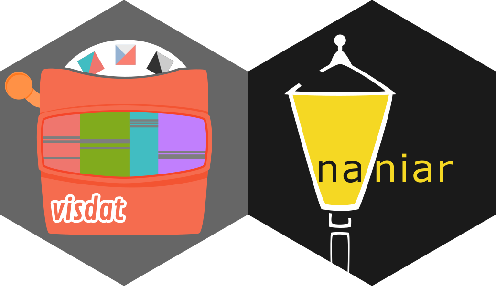
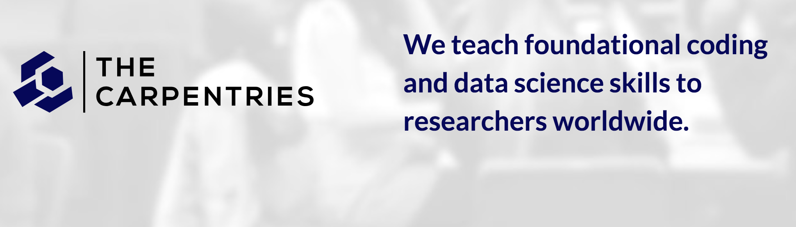
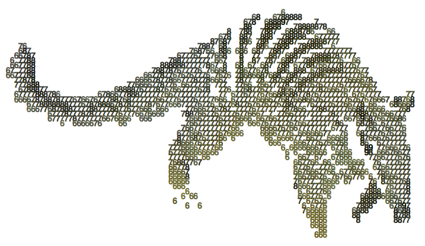
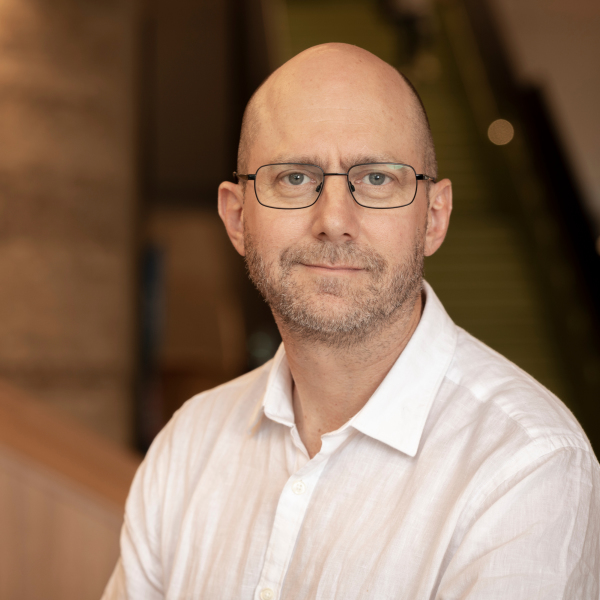

```{r setup, include=FALSE}
options(htmltools.dir.version = FALSE)
```

class: center, inverse


background-image: url(gifs/who-ami-i.gif)
background-size: contain
background-position: 50% 50%
class: center, bottom

---
class: center, inverse

# Previously: Psychology
```{r psych-image, echo = FALSE}
knitr::include_graphics("img/psych.png")
```

---
class: center, inverse
# (Somewhat) Recently: PhD statistics

```{r echo = FALSE, out.width = "75%"}

```

---
class: inverse, middle, center

# Currently: R packages


```{r learn-more, echo = FALSE, out.width = "80%"}

```

.pull-left[
.center[
.hugew[
visdat.njtierney.com
]
]
]

.pull-right[
.center[
.hugew[
naniar.njtierney.com
]
]
]

---
class: center, inverse
# Previously: The Carpentries

```{r img-carptentries, echo = FALSE}

```

---
class: center
# Currently: ~~Post Doc~~ Lecturer

.pull-left[
```{r logos, echo = FALSE}


```
]

.pull-right[
```{r di-rob, echo = FALSE, out.width = "60%"}
knitr::include_graphics("http://dicook.org/img/dicook-2019.png")

```

]


---
class: middle, center
# Our helpers

---
class: center, middle, inverse
# Your Turn

.vhugew[
Introduce yourselves to TWO other people
]

---
class: center, inverse, middle
# The bad news

.vhugew[
There are times when learning this material might be  frustrating, and that is a totally normal thing, and expected
]

---
class: center, middle
# The good news: 

.vhugeb[
This is temporary and well worth the effort. 
]

---
# The plan

.vlargeb[
- Interactive Lesson - mixed teaching and practicals

- materials available at [rmd4sci.njtierney.com](https://rmd4sci.njtierney.com)
]

---

# The plan

.large[
Course runs 10am - 2pm:

- 10am - 11:45am: 
  - Why Rmarkdown 
  - Installation 
  - Rstudio, what, and why
  - Workflow
  - Using rmarkdown
  - HTML, PDF, and Word
- 11:45am - 12:15pm: light lunch
- 12:15pm - 2pm - course
  - Keyboard shortcuts
  - Figures, Tables, and Captions
  - Customising your Figures
  - Citing Figures, Tables, and Sections
  - Citing Articles and Bibliography Styles
]

---
# Operating Style

.middle[
.center[
.vvhugeb[
Traffic Light system
]
]
]

---
class: center

# Thank you!

<!-- .middle[ -->
<!-- .vvhugeb[ -->
<!--  [goo.gl/rmgeuB](https://goo.gl/rmgeuB) -->

<!--  [github.com/njtierney/rmd4sci](https://www.github.com/njtierney/rmd4sci) -->

